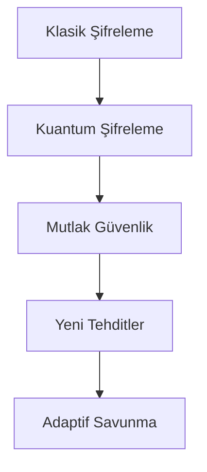

# Kuantum Şifreleme Teknolojisinde Çığır Açan Gelişme

Çin Bilimler Akademisi'nden araştırmacılar, kuantum şifreleme alanında devrim niteliğinde bir gelişmeye imza attı. Bu gelişme, klasik şifreleme yöntemlerinin ötesinde, teorik olarak kırılamaz bir güvenlik seviyesi sunuyor.

## Teknik Detaylar

### Kuantum Dolanıklık Temelli İletişim

```python
# Kuantum bit (qubit) simülasyonu örneği
def create_entangled_pair():
    qubit1 = QuantumBit(state='|0⟩')
    qubit2 = QuantumBit(state='|0⟩')
    apply_hadamard(qubit1)
    apply_cnot(qubit1, qubit2)
    return [qubit1, qubit2]
```

Sistem, kuantum dolanıklık prensibini kullanarak:
1. **Anlık İletişim**: Işık hızında güvenli veri transferi
2. **Dinleme Tespiti**: Herhangi bir dinleme girişimi anında tespit edilebiliyor
3. **Teorik Güvenlik**: Matematiksel olarak kırılamaz şifreleme

## Pratik Uygulamalar

### Finans Sektörü
- Bankalar arası güvenli iletişim
- Kripto para transferleri
- Yüksek frekanslı ticaret sistemleri

### Devlet Güvenliği
- Diplomatik iletişim
- Askeri haberleşme
- İstihbarat servisleri

## Gelecek Perspektifi

> "Bu teknoloji, post-kuantum kriptografi çağının başlangıcını işaret ediyor."
> *- Prof. Dr. Zhang Wei, Proje Lideri*

### Beklenen Gelişmeler

1. **2025**: İlk ticari uygulamalar
2. **2027**: Şehirler arası kuantum ağlar
3. **2030**: Global kuantum internet altyapısı

## Güvenlik Etkileri



### Siber Güvenlik Uzmanları İçin Öneriler

1. **Eğitim**: Kuantum bilgisayar prensiplerini öğrenin
2. **Hazırlık**: Sistemlerinizi kuantum-güvenli hale getirin
3. **İzleme**: Teknolojik gelişmeleri takip edin

## Sonuç

Bu gelişme, siber güvenlik dünyasında yeni bir çağın başlangıcını işaret ediyor. Kuantum şifreleme, gelecekte standart güvenlik protokolü haline gelebilir.

*Bu yazı, 22 Mart 2024 tarihinde yayınlanmıştır.* 